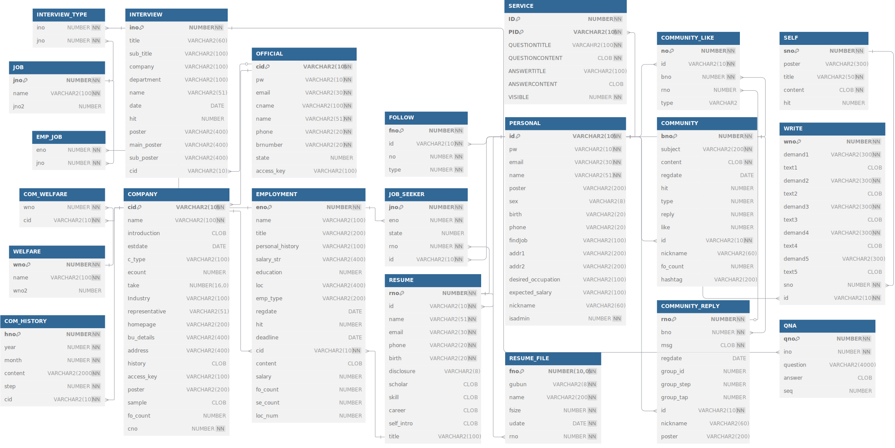

## JOBPRO

    

### 🎯&nbsp;Subject

구인구직플랫폼

### 🗓️&nbsp;Date

2025.03 (5 Weeks)

### 📄&nbsp;Presentation

[JOBPRO.pdf](./Project_Main/public/presentation.pdf)

### 🚀&nbsp;Intro & Function

> 구직하는 일반 유저와 구인하는 기업 유저를 위한 구인구직플랫폼입니다. 기업은 구인 공고를 작성하고, 구직자는 이력서와 자기소개서를 작성 후 공고에 지원할 수 있습니다. SI 구조를 경험해보기 위해 일반 유저, 기업 유저, 공고, 커뮤니티, 고객센터의 목록, 상세보기, 작성, 검색 등이 가능한 관리자 페이지도 구현하였습니다.
> 
> #### 주요 기능
> - 회사가 구인 공고를 작성할 수 있습니다.
> - 구직자는 이력서와 자기소개서를 작성하고, 공고에 지원할 수 있습니다.
> - 관리자는 유저, 회사, 공고, 커뮤니티 글, 고객센터를 관리할 수 있습니다.

### 📚&nbsp;Tech Stack

-007396?style=flat-square&logo=data:image/svg%2bxml;base64,PCFET0NUWVBFIHN2ZyBQVUJMSUMgIi0vL1czQy8vRFREIFNWRyAxLjEvL0VOIiAiaHR0cDovL3d3dy53My5vcmcvR3JhcGhpY3MvU1ZHLzEuMS9EVEQvc3ZnMTEuZHRkIj4KDTwhLS0gVXBsb2FkZWQgdG86IFNWRyBSZXBvLCB3d3cuc3ZncmVwby5jb20sIFRyYW5zZm9ybWVkIGJ5OiBTVkcgUmVwbyBNaXhlciBUb29scyAtLT4KPHN2ZyB3aWR0aD0iMTUwcHgiIGhlaWdodD0iMTUwcHgiIHZpZXdCb3g9IjAgMCAzMi4wMCAzMi4wMCIgdmVyc2lvbj0iMS4xIiB4bWxucz0iaHR0cDovL3d3dy53My5vcmcvMjAwMC9zdmciIHhtbG5zOnhsaW5rPSJodHRwOi8vd3d3LnczLm9yZy8xOTk5L3hsaW5rIiBmaWxsPSIjZmZmZmZmIiBzdHJva2U9IiNmZmZmZmYiIHN0cm9rZS13aWR0aD0iMC4yNTYiPgoNPGcgaWQ9IlNWR1JlcG9fYmdDYXJyaWVyIiBzdHJva2Utd2lkdGg9IjAiLz4KDTxnIGlkPSJTVkdSZXBvX3RyYWNlckNhcnJpZXIiIHN0cm9rZS1saW5lY2FwPSJyb3VuZCIgc3Ryb2tlLWxpbmVqb2luPSJyb3VuZCIvPgoNPGcgaWQ9IlNWR1JlcG9faWNvbkNhcnJpZXIiPiA8cGF0aCBmaWxsPSIjZmZmZmZmIiBkPSJNMTIuNTU3IDIzLjIyYzAgMC0wLjk4MiAwLjU3MSAwLjY5OSAwLjc2NSAyLjAzNyAwLjIzMiAzLjA3OSAwLjE5OSA1LjMyNC0wLjIyNiAwIDAgMC41OSAwLjM3IDEuNDE1IDAuNjkxLTUuMDMzIDIuMTU3LTExLjM5LTAuMTI1LTcuNDM3LTEuMjN6TTExLjk0MiAyMC40MDVjMCAwLTEuMTAyIDAuODE2IDAuNTgxIDAuOTkgMi4xNzYgMC4yMjQgMy44OTUgMC4yNDMgNi44NjktMC4zMyAwIDAgMC40MTEgMC40MTcgMS4wNTggMC42NDUtNi4wODUgMS43NzktMTIuODYzIDAuMTQtOC41MDgtMS4zMDV6TTE3LjEyNyAxNS42M2MxLjI0IDEuNDI4LTAuMzI2IDIuNzEzLTAuMzI2IDIuNzEzczMuMTQ5LTEuNjI1IDEuNzAzLTMuNjYxYy0xLjM1MS0xLjg5OC0yLjM4Ni0yLjg0MSAzLjIyMS02LjA5MyAwIDAtOC44MDEgMi4xOTgtNC41OTggNy4wNDJ6TTIzLjc4MyAyNS4zMDJjMCAwIDAuNzI3IDAuNTk5LTAuODAxIDEuMDYyLTIuOTA1IDAuODgtMTIuMDkxIDEuMTQ2LTE0LjY0MyAwLjAzNS0wLjkxNy0wLjM5OSAwLjgwMy0wLjk1MyAxLjM0NC0xLjA2OSAwLjU2NC0wLjEyMiAwLjg4Ny0wLjEgMC44ODctMC4xLTEuMDIwLTAuNzE5LTYuNTk0IDEuNDExLTIuODMxIDIuMDIxIDEwLjI2MiAxLjY2NCAxOC43MDYtMC43NDkgMTYuMDQ0LTEuOTV6TTEzLjAyOSAxNy40ODljMCAwLTQuNjczIDEuMTEtMS42NTUgMS41MTMgMS4yNzQgMC4xNzEgMy44MTQgMC4xMzIgNi4xODEtMC4wNjYgMS45MzQtMC4xNjMgMy44NzYtMC41MSAzLjg3Ni0wLjUxcy0wLjY4MiAwLjI5Mi0xLjE3NSAwLjYyOWMtNC43NDUgMS4yNDgtMTMuOTExIDAuNjY3LTExLjI3Mi0wLjYwOSAyLjIzMi0xLjA3OSA0LjA0Ni0wLjk1NiA0LjA0Ni0wLjk1NnpNMjEuNDEyIDIyLjE3NGM0LjgyNC0yLjUwNiAyLjU5My00LjkxNSAxLjAzNy00LjU5MS0wLjM4MiAwLjA3OS0wLjU1MiAwLjE0OC0wLjU1MiAwLjE0OHMwLjE0Mi0wLjIyMiAwLjQxMi0wLjMxOGMzLjA3OS0xLjA4MyA1LjQ0OCAzLjE5My0wLjk5NCA0Ljg4Ny0wIDAgMC4wNzUtMC4wNjcgMC4wOTctMC4xMjZ6TTE4LjUwMyAzLjMzN2MwIDAgMi42NzEgMi42NzItMi41MzQgNi43ODEtNC4xNzQgMy4yOTYtMC45NTIgNS4xNzYtMC4wMDIgNy4zMjMtMi40MzYtMi4xOTgtNC4yMjQtNC4xMzMtMy4wMjUtNS45MzQgMS43NjEtMi42NDQgNi42MzgtMy45MjUgNS41Ni04LjE3ek0xMy41MDMgMjguOTY2YzQuNjMgMC4yOTYgMTEuNzQtMC4xNjQgMTEuOTA4LTIuMzU1IDAgMC0wLjMyNCAwLjgzMS0zLjgyNiAxLjQ5LTMuOTUyIDAuNzQ0LTguODI2IDAuNjU3LTExLjcxNiAwLjE4IDAgMCAwLjU5MiAwLjQ5IDMuNjM1IDAuNjg1eiIvPiA8L2c+Cg08L3N2Zz4=)

 

 
 
 

 
 

### 📂&nbsp;ERD

### ⚙️&nbsp;Features

---

    
일반 유저

    <ul>
        <li>회원가입, 로그인, 로그아웃 </li>   
        <li>마이페이지 - 회원 정보/비밀번호 수정, 즐겨찾기, 지원 공고 내역, 이력서 관리 </li>
        <li>공고 - 목록, 상세보기, 지원하기 </li>
        <li>기업 - 목록, 상세보기, 진행 중인 공고 목록 </li>
        <li>커뮤니티 - 실시간 채팅, 묻고 답하기 목록/상세보기/작성, 인터뷰, 연봉계산기, 자기소개서 검색/샘플 </li>
        <li>QnA - 목록, 상세보기, 작성 </li>
    </ul>

    
기업 유저

    <ul>
        <li>회원가입, 로그인, 로그아웃 </li>   
        <li>마이페이지 - 기업 정보/비밀번호 수정, 기업 정보 수정, 공고 관리/작성, 지원자 조회, 계정 정보 </li>
        <li>QnA - 목록, 상세보기, 작성 </li>
    </ul>

    
관리자

    <ul>
        <li>로그인, 로그아웃 </li>   
        <li>메인 - 일반 유저 수, 기업 유저 수, 공고 대비 지원자, 일일 인사이트 대시보드</li>
        <li>유저관리 - 목록, 상세보기, 삭제, 검색 기능</li>
        <li>기업관리 - 목록, 상세보기, 삭제, 검색 기능, 가입 신청한 기업 목록(승인/거절) 관리</li>
        <li>공고관리 - 목록, 상세보기, 삭제, 검색 기능</li>
        <li>커뮤니티관리 - 목록, 상세보기, 삭제, 검색 기능</li>
        <li>QnA관리 - 목록, 상세보기, 삭제, 답변 작성, 검색 기능</li>
    </ul>

